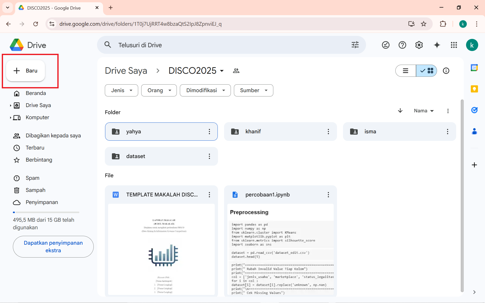
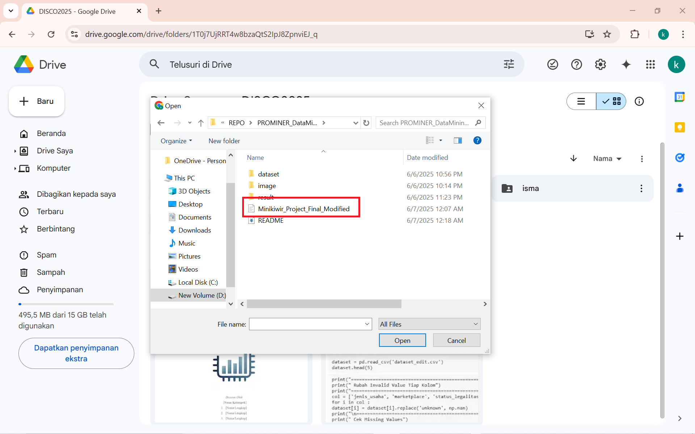
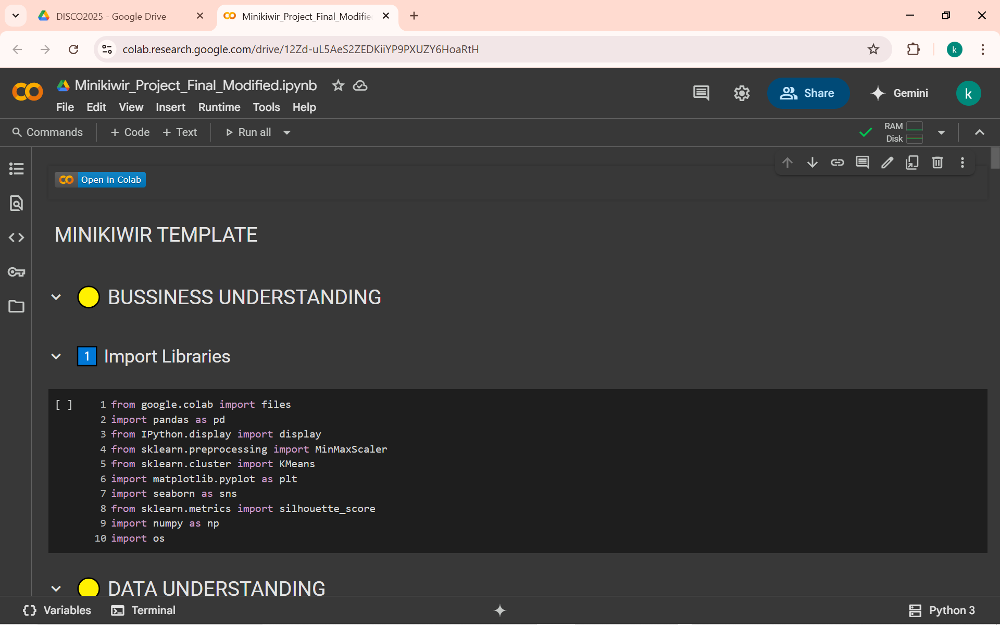
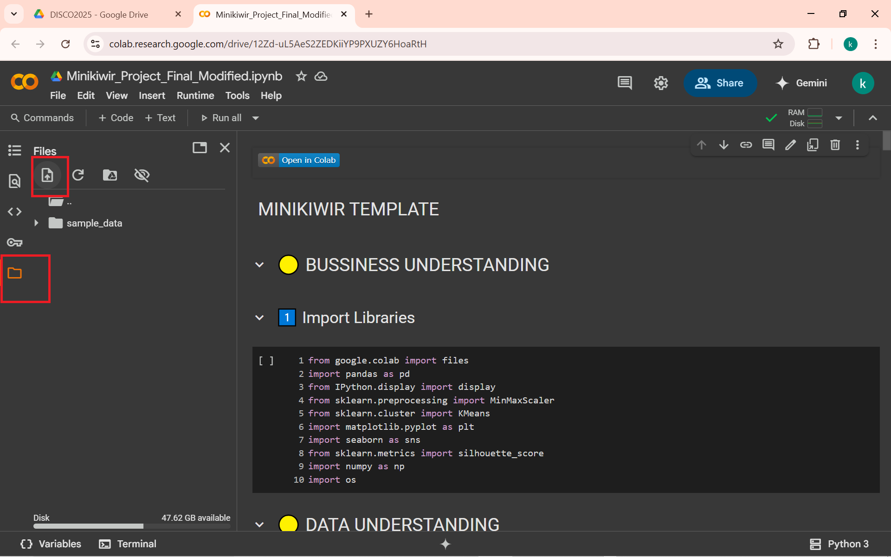
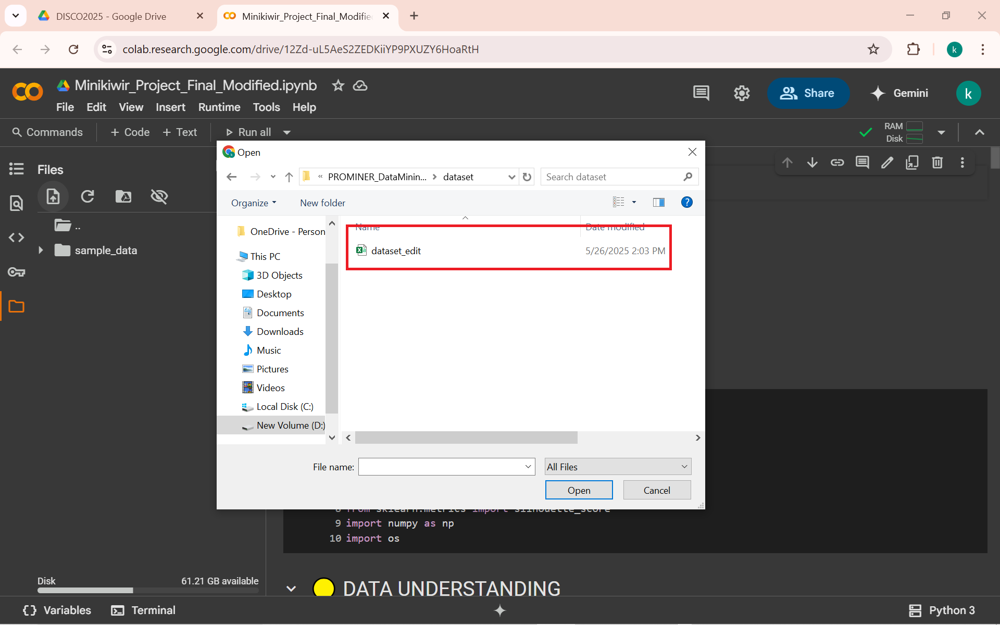
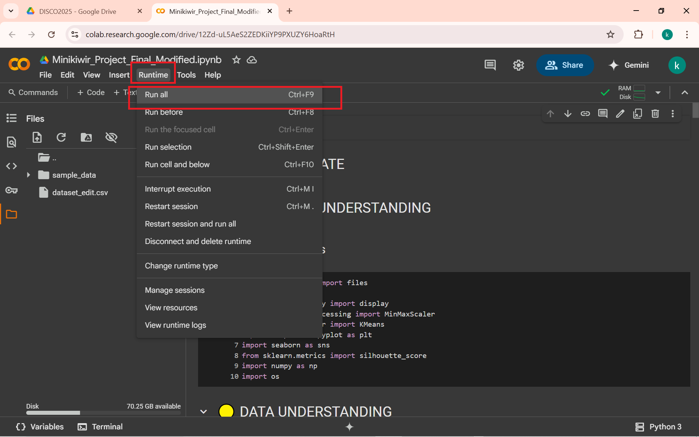
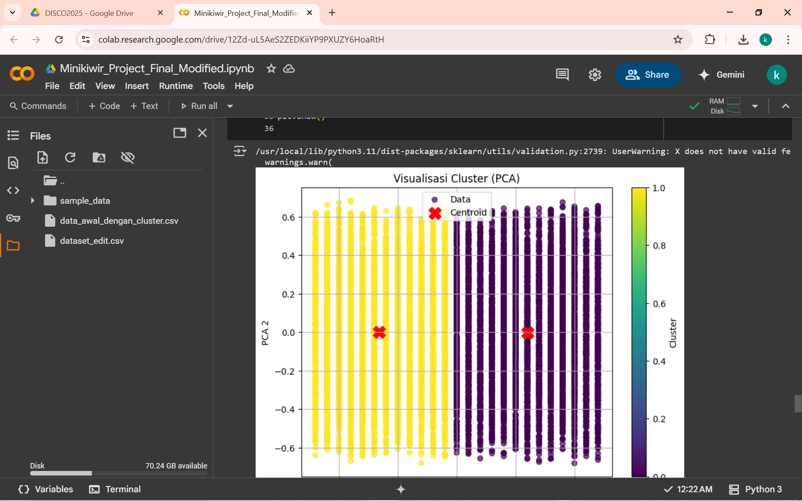

# PROMINER_DataMining_Minikiwir

Repositori ini berisi dataset, notebook dan hasil analisis dari proyek data mining. Proyek ini bertujuan untuk melakukan clustering UMKM menggunakan algoritma machine learning K-MEANS.

---

## 🚀 Langkah-Langkah Menjalankan Proyek

Ikuti urutan langkah berikut agar proyek ini bisa langsung dijalankan setelah clone.

---

### 1. Clone Repository

git clone https://github.com/inikanipp/PROMINER_DataMining_Minikiwir.git

### 2. Jalankan Notebook di Google Colab

a. Buka Google Drive
 
b. Klik Tombol (+) pada pojok kanan atas

 
c. Pilih upload file dan pilih file colab hasil cloning tadi pada folder "PROMINER_DataMining_Minikiwir"

 
d. Buka file colab yang sudah berhasil diupload tadi.

 
e. Upload file dataset mentah padaicon file di sidebar

 
f. Pilih file dataset_edit.csv pada folder "PROMINER_DataMining_Minikiwir/dataset/dataset_edit.csv"

 
g. pilih runtime pada toolbar dan pilih run all

 
h. program sudah berhasil dijalankan

